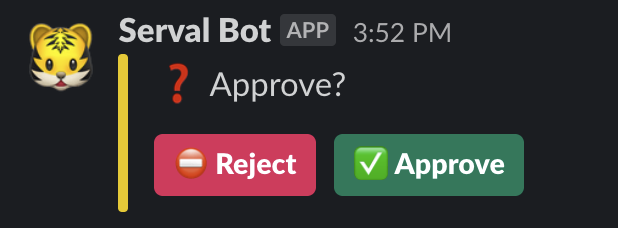

# Slack - Approval

This example would send an approval question towards the channel:


This task only works with the Bot API as explained in the message task.
You can use the result of the "reject" and "approve" button in the pipeline itself like this:

```yaml
apiVersion: tekton.dev/v1beta1
kind: PipelineRun
metadata:
  generateName: approval
  annotations:
    serval.dev/slack-channel: "#serval"
spec:
  pipelineSpec:
    tasks:
    - name: slack-approval
      taskRef:
        apiVersion: serval.dev/v1
        kind: SlackApprove
      params:
      - name: message
        value: ":question: Approve?"
      # a timeout after which the approval times out
      # it is in seconds
      - name: timeout
        value: "1200" # 20 minutes
    - name: slack-timeout
      runAfter:
      - slack-approval
      when:
      - input: "$(tasks.slack-approval.results.result)"
        operator: in
        values: ["timeout"]
      taskRef:
        apiVersion: serval.dev/v1
        kind: SlackWrite
      params:
      - name: message
        value: ":ok_hand: Timeout!"
    - name: slack-approved
      runAfter:
      - slack-approval
      when:
      - input: "$(tasks.slack-approval.results.result)"
        operator: in
        values: ["approved"]
      taskRef:
        apiVersion: serval.dev/v1
        kind: SlackWrite
      params:
      - name: message
        value: ":ok_hand: Approved!"
    - name: slack-rejected
      runAfter:
      - slack-approval
      when:
      - input: "$(tasks.slack-approval.results.result)"
        operator: in
        values: ["rejected"]
      taskRef:
        apiVersion: serval.dev/v1
        kind: SlackWrite
      params:
      - name: message
        value: ":ok_hand: Rejected!"
```